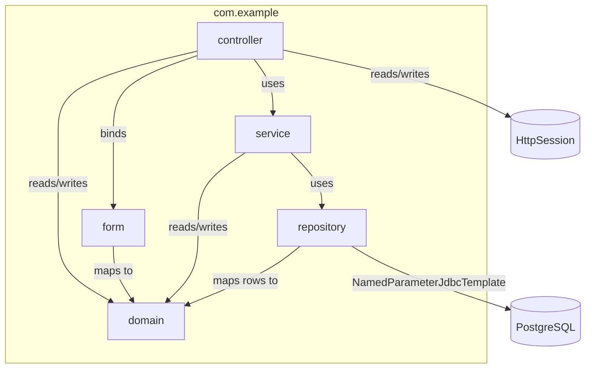
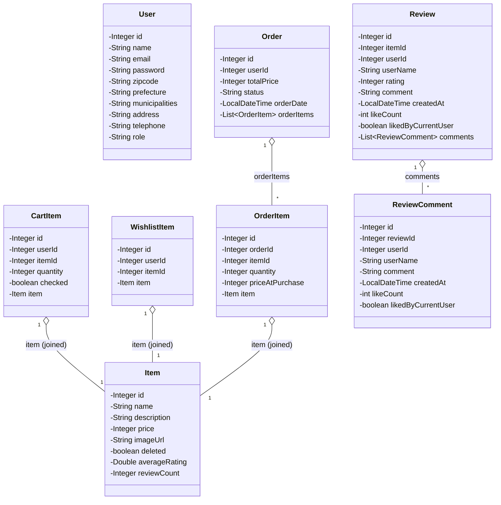
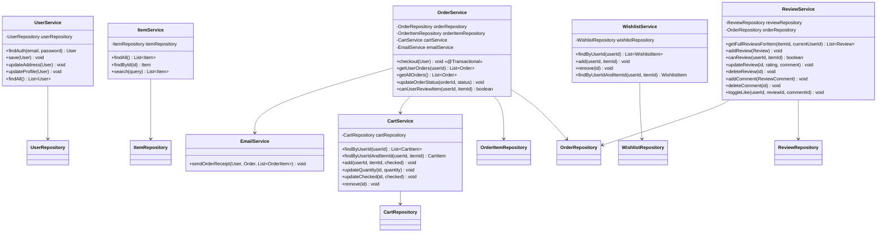
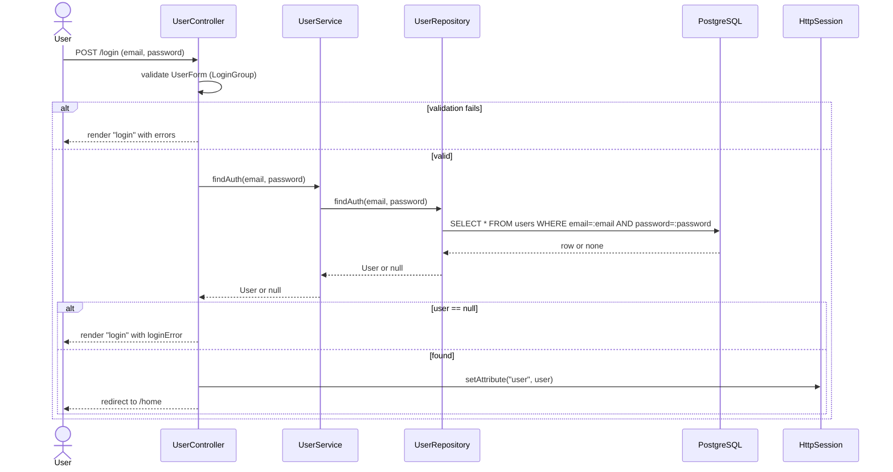
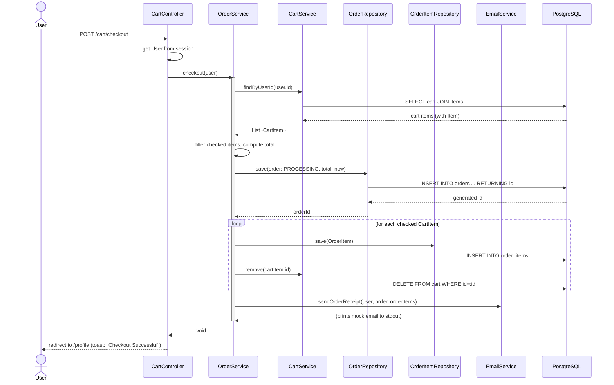
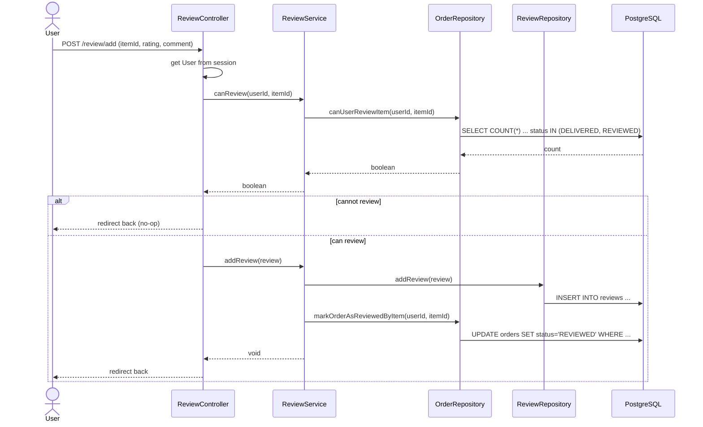

# Java Architecture Design — demo-ecsite

This document describes the existing Java architecture of the `demo-ecsite` application as built. It is a reference for the current state of the codebase, not a proposal for change.

## 1. Overview

`demo-ecsite` is a Spring Boot 4 / Thymeleaf e-commerce application using a classic **layered MVC architecture**:

```
Controller  →  Service  →  Repository  →  PostgreSQL
     ↓             ↓
   Form         Domain
```

- **Controller layer** — `@Controller` classes handle HTTP requests, read/write `HttpSession` for auth state, and select Thymeleaf view names.
- **Form layer** — `UserForm` is a dedicated form-binding/validation object used only by `UserController` (login/sign-in). Other controllers bind directly to domain objects or `@RequestParam`.
- **Service layer** — `@Service` classes hold business logic and orchestrate one or more repositories. Some services depend on other services (e.g. `OrderService` depends on `CartService` and `EmailService`).
- **Repository layer** — `@Repository` classes use Spring's `NamedParameterJdbcTemplate` directly (no JPA/Hibernate). Each repository defines its SQL inline and a static `RowMapper`.
- **Domain layer** — plain Lombok-annotated POJOs (`@Getter`/`@Setter`/`@Data`) representing both DB rows and view-model data (some fields, like `Item.averageRating`, are populated only by certain queries).
- **Cross-cutting** — `GlobalControllerAdvice` (`@ControllerAdvice`) injects the cart item count into every view's model.

Authentication is session-based: on login, a `User` object is stored directly in `HttpSession` under the `"user"` attribute, and controllers read it back to check login state and role (`"ADMIN"` vs `"USER"`).

---

## 2. Package & Layer Dependency Diagram



---

## 3. Domain Model Class Diagram

All domain classes live in `com.example.domain` and are plain Lombok POJOs (no behavior, no JPA annotations).



**Notes:**
- `CartItem.item`, `WishlistItem.item`, `OrderItem.item`, and `Review.userName` are populated via SQL `JOIN`s in the repository row mappers — they are not foreign-key object references managed by an ORM.
- `Item.averageRating` / `reviewCount` are populated only by `ItemRepository.findAll()` / `findById()`, which compute them via `LEFT JOIN reviews` + `AVG`/`COUNT`.

---

## 4. Repository Layer Class Diagram

All repositories are `@Repository` beans that inject `NamedParameterJdbcTemplate` and define a private static `RowMapper` per returned domain type.

```mermaid
classDiagram
    class UserRepository {
        -NamedParameterJdbcTemplate template
        +findAll() List~User~
        +findAuth(email, password) User
        +save(User) void
        +updateAddress(User) void
        +updateProfile(User) void
    }

    class ItemRepository {
        -NamedParameterJdbcTemplate template
        +findAll() List~Item~
        +findById(id) Item
        +search(query) List~Item~
    }

    class CartRepository {
        -NamedParameterJdbcTemplate template
        +findByUserId(userId) List~CartItem~
        +findByUserIdAndItemId(userId, itemId) CartItem
        +add(userId, itemId, checked) void
        +updateQuantity(id, quantity) void
        +updateChecked(id, checked) void
        +remove(id) void
    }

    class WishlistRepository {
        -NamedParameterJdbcTemplate template
        +findByUserId(userId) List~WishlistItem~
        +findByUserIdAndItemId(userId, itemId) WishlistItem
        +add(userId, itemId) void
        +remove(id) void
    }

    class OrderRepository {
        -NamedParameterJdbcTemplate template
        +findAll() List~Order~
        +findByUserId(userId) List~Order~
        +save(Order) Integer
        +updateStatus(id, status) void
        +canUserReviewItem(userId, itemId) boolean
        +markOrderAsReviewedByItem(userId, itemId) void
    }

    class OrderItemRepository {
        -NamedParameterJdbcTemplate template
        +save(OrderItem) void
        +findByOrderId(orderId) List~OrderItem~
    }

    class ReviewRepository {
        -NamedParameterJdbcTemplate template
        +findReviewsByItemId(itemId, currentUserId) List~Review~
        +findCommentsByReviewId(reviewId, currentUserId) List~ReviewComment~
        +addReview(Review) void
        +updateReview(id, rating, comment) void
        +deleteReview(id) void
        +addComment(ReviewComment) void
        +deleteComment(id) void
        +toggleLike(userId, reviewId, commentId) void
    }

    UserRepository ..> User
    ItemRepository ..> Item
    CartRepository ..> CartItem
    CartRepository ..> Item
    WishlistRepository ..> WishlistItem
    WishlistRepository ..> Item
    OrderRepository ..> Order
    OrderItemRepository ..> OrderItem
    OrderItemRepository ..> Item
    ReviewRepository ..> Review
    ReviewRepository ..> ReviewComment
```



**Notable repository details:**
- `ItemRepository.search()` splits the query into words and requires every word to match `name` or `description` (`ILIKE`), ANDed together.
- `OrderRepository.canUserReviewItem()` checks for an order containing the item with status `DELIVERED` or `REVIEWED`.
- `ReviewRepository.toggleLike()` handles likes for **both** reviews and comments via nullable `review_id`/`comment_id` columns on `review_likes`.

---

## 5. Service Layer Class Diagram

Services are `@Service` beans containing business logic. Most are thin pass-throughs to a single repository; `OrderService` and `ReviewService` orchestrate multiple dependencies.



**Notable service details:**
- `OrderService.checkout()` is the only `@Transactional` method: it filters the cart for `checked` items, computes the total, inserts an `Order` + `OrderItem`s, removes those items from the cart, and triggers `EmailService.sendOrderReceipt()` (which just prints to stdout — no real email integration).
- `ReviewService.addReview()` calls `OrderRepository.markOrderAsReviewedByItem()` to flip a `DELIVERED` order to `REVIEWED` status after the user reviews an item from it.
- `EmailService` has no repository dependency — it's a pure formatting/output utility (mock email).

---

## 6. Controller + Form Layer Class Diagram

```mermaid
classDiagram
    class UserController {
        -UserService userService
        -OrderService orderService
        -HttpSession session
        +login(Model) String
        +login(UserForm, BindingResult, Model) String
        +signin(Model) String
        +signin(UserForm, BindingResult) String
        +updateAddress(...) String
        +logout() String
        +viewProfile(Model) String
        +updateProfile(...) String
    }

    class ItemController {
        -ItemService itemService
        -WishlistService wishlistService
        -OrderService orderService
        -ReviewService reviewService
        -HttpSession session
        +root() String
        +home(Model) String
        +itemDetail(id, Model) String
        +search(query, Model) String
    }

    class CartController {
        -CartService cartService
        -OrderService orderService
        -HttpSession session
        +viewCart(Model) String
        +add(itemId, ...) String
        +buyNow(itemId) String
        +updateChecked(id, checked) String
        +updateQuantity(id, quantity, ...) String
        +remove(id) String
        +checkout(...) String
    }

    class WishlistController {
        -WishlistService wishlistService
        -HttpSession session
        +viewWishlist(Model) String
        +add(itemId, ...) String
        +remove(id) String
    }

    class ReviewController {
        -ReviewService reviewService
        -HttpSession session
        +addReview(Review, ...) String
        +editReview(id, rating, comment, ...) String
        +deleteReview(id, ...) String
        +addComment(ReviewComment, ...) String
        +deleteComment(id, ...) String
        +toggleLike(reviewId, commentId, ...) String
    }

    class AdminController {
        -HttpSession session
        -UserService userService
        -ItemService itemService
        -OrderService orderService
        +adminDashboard(Model) String
        +updateOrderStatus(orderId, status, ...) String
    }

    class GlobalControllerAdvice {
        -CartService cartService
        -HttpSession session
        +addGlobalAttributes(Model) void «@ModelAttribute»
    }

    class UserForm {
        -String name
        -String email
        -String password
        -String zipcode
        -String prefecture
        -String municipalities
        -String address
        -String telephone
        +interface LoginGroup
        +interface SignInGroup
    }

    UserController --> UserService
    UserController --> OrderService
    UserController ..> UserForm
    ItemController --> ItemService
    ItemController --> WishlistService
    ItemController --> OrderService
    ItemController --> ReviewService
    CartController --> CartService
    CartController --> OrderService
    WishlistController --> WishlistService
    ReviewController --> ReviewService
    AdminController --> UserService
    AdminController --> ItemService
    AdminController --> OrderService
    GlobalControllerAdvice --> CartService
```



**Notable controller details:**
- `UserForm` has two Bean Validation groups (`LoginGroup`, `SignInGroup`) so the same form class can apply different `@NotBlank`/`@Email` rules to the login vs. sign-in pages.
- `GlobalControllerAdvice` runs before every controller method, adding `cartCount` to the model if a user is logged in — this powers the cart badge shown across all pages.
- Most "write" endpoints (cart, wishlist, review) redirect back to the `Referer` header rather than a fixed page, so the user stays on the page they acted from.
- `AdminController` enforces role-based access (`"ADMIN"`) via a manual session check in each method (no Spring Security).

---

## 7. Key Flow Sequence Diagrams

### 7.1 Login



### 7.2 Checkout



### 7.3 Add Review



---

## 8. Database Table ↔ Domain Class Mapping

| Table | Domain Class(es) | Notes |
|---|---|---|
| `users` | `User` | `role` column drives `USER` vs `ADMIN` access checks |
| `items` | `Item` | `averageRating`/`reviewCount` are computed, not stored columns |
| `cart` | `CartItem` | joined with `items` for display fields (`item.name`, `item.price`, `item.imageUrl`) |
| `wishlist` | `WishlistItem` | joined with `items` the same way as `cart` |
| `orders` | `Order` | `orderItems` populated separately via `OrderItemRepository` |
| `order_items` | `OrderItem` | joined with `items` for `item.name`/`item.imageUrl` |
| `reviews` | `Review` | `userName`, `likeCount`, `likedByCurrentUser` computed via joins/subqueries |
| `review_comments` | `ReviewComment` | same computed fields as `Review` |
| `review_likes` | *(no dedicated domain class)* | polymorphic like table for reviews/comments, managed entirely inside `ReviewRepository.toggleLike()` |
